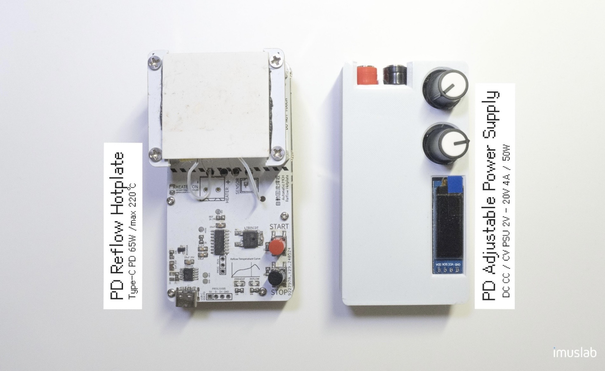

# PD Adjustable DC Power Supply

A DIY, USB PD powered, pocket sized adjustable DC / lab bench power supply for electronic makers

I also made a pocket size reflow hotplate for automatically reflowing SMD components. See [here](https://github.com/tobychui/MCH-PD-Automatic-Reflow-Hotplate) for more details on how to build one. These two pocket size devices have the same footprint so they can be stacked in your portable tool box!

### Specifications

| Item             | Value                                                        | Remarks                                              |
| ---------------- | ------------------------------------------------------------ | ---------------------------------------------------- |
| Power Input      | USB PD (type C) 60W at 20V 3A                                | Refer to CH224K datasheet for trigger specifications |
| Power Output     | Adjustable DC (2V to 20V), max 4A or 50W                     | Refer to XL4015E datasheet for specification         |
| Dimension        | 10cm x 5.2cm x 1.9cm (without knobs) 10cm x 5.2cm x 3.3cm (with knobs) | Adj. Knobs are replaceable                           |
| Output Mode      | Constant Voltage (CV) / Constant Current (CC)                |                                                      |
| Display Size     | 0.91 inch OLED                                               |                                                      |
| Display Accuracy | +/- 0.02V and +/- 0.05A                                      | Refresh rate @ 1Hz                                   |
| Data Output      | Real-time voltage and current usage in csv format            | Can be viewed via Arduino IDE serial graph plotter   |

### Photo

### Setting a Current Limit

Here are the steps to set the current limit on the PD power supply

1. Reduce both the output voltage and current to the lowest by rotating the knobs anticlockwise
2. Short the output positive and negative terminal. Now, the power supply should automatically switch into CC mode.
   
3. Slowly increase the current output by rotating the current knob (left knob) clockwise until a desired current is reached
4. Release the shorted terminal, now the power supply should automatically switch back to CV mode.
5. Increase the voltage until the target voltage output is reached.
   

### Folder Structure

- Firmware: The CH552G firmware for the real time information display
- PCB: The Gerber files and EasyEDA source file (which you can generate part lists / BOM from the online editor if needed)
- 3D Model: The 3D model for the case
- Schematic: Circuit diagram & Schematic file & logic circuit analysis
- Photo: Some photo shoot of the finalized product

### Version Info

If you are planning to make one with the help of PCBA services, you can use the version 4 which is optimized for semi-PCBA manufacturing routine. 

If you are planning to DIY one from scratch (only the PCB is printed, all other parts are manually soldered), consider using reversion 5 by HCCLAB which has been optimized for manual soldering.

### Firmware Flashing

The firmware used by this PD power supply requires Arduino IDE with [CH55xduino](https://github.com/DeqingSun/ch55xduino) installed. There are no external dependencies except the above board library.

**The firmware code is designed for 0.91 inch single color OLED module running over I2C mode only**. Other display module will not work.

To flash the firmware, connect to the power supply via the lower USB port (the one closer to the display ). The CH552G has internal USB host that do not require an external USB to UART chips like CH340. If you have the CH55xduino correctly installed, your computer should detect an unknown USB device (before firmware flashing) or a virtual serial port (after firmware flashed) where you can use as a COM port to flash new firmware. 

### License

- Code: MIT
- Hardware and 3D model designs: CC BY-NC-SA

