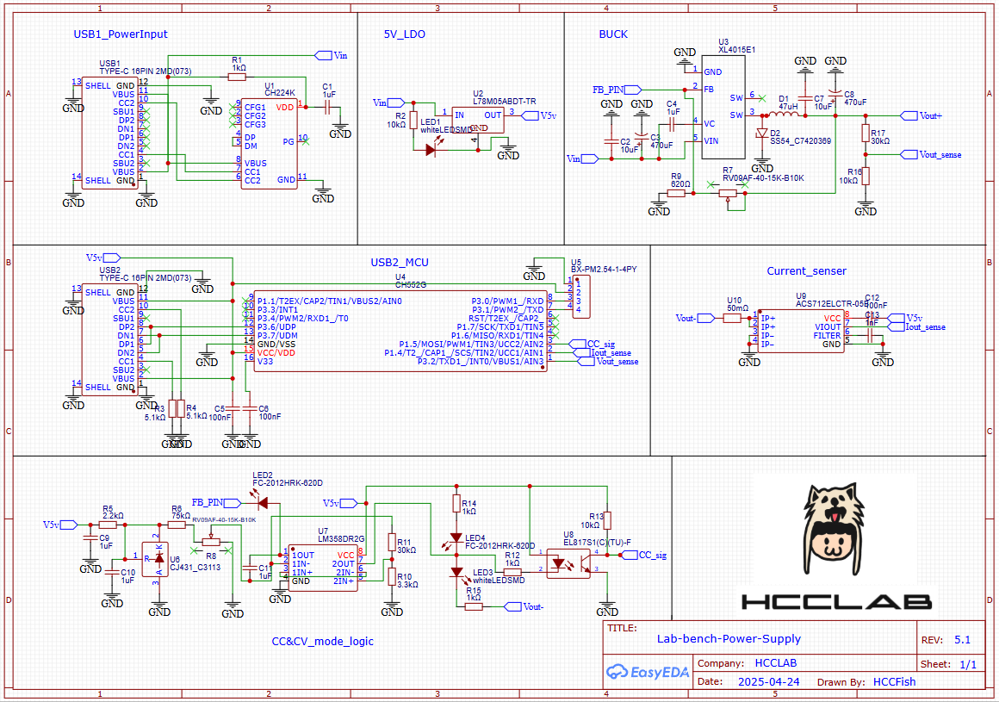
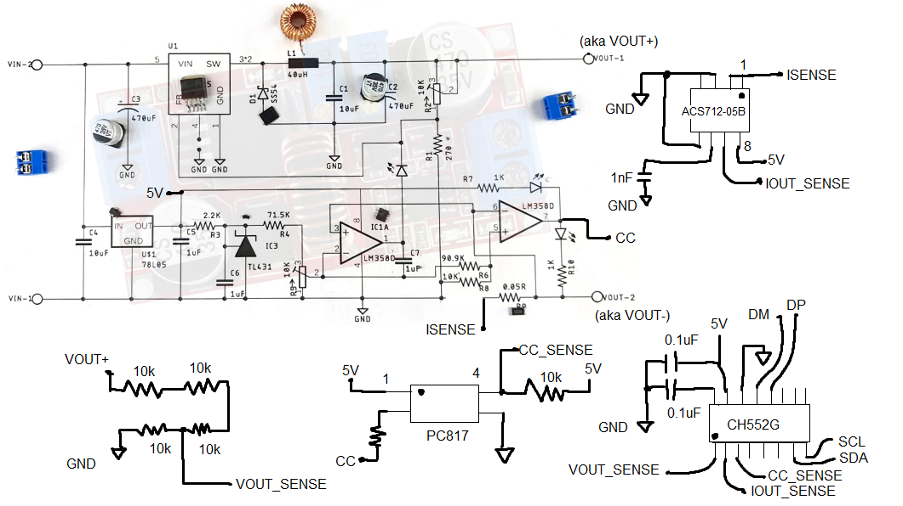
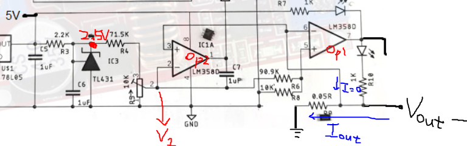

# Schematic

---

# Schematic draft

---

# OpAmp Analysis

> **Note:**
>
> - Vout- = Iout × 0.05 Ω  
> - 0 kΩ ≤ Rcurrent (R9) ≤ 10 kΩ  
> - V1 = 2.5 × (Rcurrent / (R4 + Rcurrent))

---

## OpAmp1 (Right Side)

### Inputs

- **Non-inverting (+):** Vout-
- **Inverting (–):** V1 × (R8 / (R6 + R8)) ≈ V1 / 10

### Output

#### Case 1: If Vout- > V1/10

- Vout- / 0.25 > (Rcurrent / (R4 + Rcurrent))
- Iout > 5 × (Rcurrent / (R4 + Rcurrent))
- **Result:** Output = 5V → Constant Current (CC) mode

#### Case 2: If Vout- < V1/10

- Vout- / 0.25 < (Rcurrent / (R4 + Rcurrent))
- Iout < 5 × (Rcurrent / (R4 + Rcurrent))
- **Result:** Output = 0V → Constant Voltage (CV) mode

---

## OpAmp2 (Left Side)

### Inputs

- **Non-inverting (+):** V1, where V1 = 2.5 × (Rcurrent / (R4 + Rcurrent))
- **Inverting (–):** Vout-

### Output

#### Case 1: If V1 > Vout-

- (Rcurrent / (R4 + Rcurrent)) > Vout- / 2.5  
- (Rcurrent / (R4 + Rcurrent)) > 0.02 × Iout)
- 50 × (Rcurrent / (R4 + Rcurrent)) > Iout
- **Result:** Output = 5V → Short

#### Case 2: If V1 < Vout-

- (Rcurrent / (R4 + Rcurrent)) < Vout- / 2.5  
- (Rcurrent / (R4 + Rcurrent)) < 0.02 × Iout)
- 50 × (Rcurrent / (R4 + Rcurrent)) < Iout
- **Result:** Output = 0V → Not short

---

## Summary

- **CC mode and Short:** When Iout > 50 × (Rcurrent / (R4 + Rcurrent))
- **CC mode and Not short:** When 50 × (Rcurrent / (R4 + Rcurrent)) > Iout > 5 × (Rcurrent / (R4 + Rcurrent))
- **CV mode and Not short:** When Iout < 5 × (Rcurrent / (R4 + Rcurrent))

> **Notice:**  
> Due to the finite open-loop gain and input offset voltage, the circuit does not behave ideally, resulting in some deviation.

---

## Example Calculation

Assume the following values:  
- R4 = 75K  
- Maximum Rcurrent = 10K

1. **Calculate the ratio:**  
   Ratio = Rcurrent / (R4 + Rcurrent) = 10K / (75K + 10K) = 10/85 ≈ 0.1176

2. **Determine the thresholds for Iout:**
   - **CC mode and Short:**  
     Iout > 50 × 0.1176 ≈ 5.88  
   - **CC mode and Not short:**  
     5.88 > Iout > 5 × 0.1176 ≈ 0.588  
   - **CV mode and Not short:**  
     Iout < 0.588

These threshold values illustrate how the circuit behavior changes based on the output current when R4 is 75K and the maximum Rcurrent is 10K.

