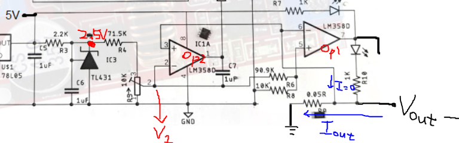

OpAmp analysis
===

> ## Note
> 
> Vout- = Iout * 0.05Ω
> 
> 0kΩ<=Rcurrent(R9)<=10kΩ
> 
> V1 = 2.5*(Rcurrent/(R4+Rcurrent))

## OpAmp1(right one)

### input+ = Vout-

### input- = V1*(R8/(R6+R8))~=V1/10

### output
if( Vout- > V1/10 )

Vout- / 0.25 > (Rcurrent/(R4+Rcurrent))

Iout > 5(Rcurrent/R4+Rcurrent)

==>5V ==> CC mode

if(Vout- < V1/10)

Vout- / 0.25 < (Rcurrent/(R4+Rcurrent))

Iout < 5(Rcurrent/(R4+Rcurrent))

==>0V ==> CV mode

## OpAmp2(left one)

### input+ = V1
V1 = 2.5*(Rcurrent/(R4+Rcurrent))

### input- = Vout-

### output
if(V1>Vout-)

(Rcurrent/(R4+Rcurrent))>Vout-/2.5

(Rcurrent/(R4+Rcurrent))>0.02*Iout

50(Rcurrent/(R4+Rcurrent))>Iout

==>5V ==> short

if(V1<Vout-)

(Rcurrent/(R4+Rcurrent))<Vout-/2.5

(Rcurrent/(R4+Rcurrent))<0.02*Iout

50(Rcurrent/(R4+Rcurrent))<Iout

==>0V ==> Not short

## Summary
When(Iout>50(Rcurrent/(R4+Rcurrent)))

==> CC mode AND short

---
When(50(Rcurrent/(R4+Rcurrent))>Iout>5(Rcurrent/(R4+Rcurrent)))

==> CC mode AND Not short

---
When(5(Rcurrent/(R4+Rcurrent))>Iout)

==> CV mode AND Not short
